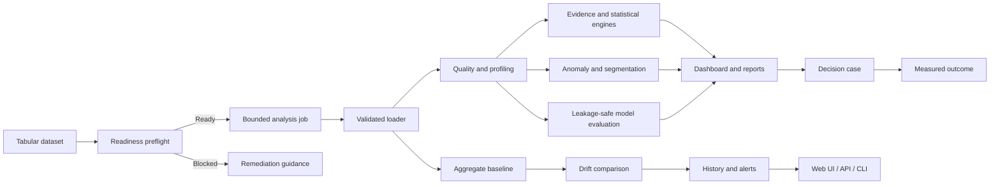

# Data Prism

[](https://github.com/NikitaMarshchonok/data-prism/actions/workflows/ci.yml)

**Evidence-first automated data science and drift monitoring for tabular data.**

Data Prism turns CSV, TSV, Excel, JSON, and Parquet files into an interactive analysis workspace. It combines deterministic data-quality checks, statistically validated findings, leakage-safe model evaluation, and persistent drift monitoring in one Flask application.

The project is designed as a decision-support system: every important conclusion should be traceable to a metric, sample size, confidence estimate, baseline, or diagnostic—not just an LLM-generated narrative. A deterministic analytical quality gate measures known-signal detection and false discoveries on synthetic benchmark scenarios before changes are merged.


## What the system does

| Area | Capabilities |
| --- | --- |
| Data intake | Validated uploads, safe filenames, normalized working copies, configurable size limits, and row limits |
| Dataset readiness | Pre-analysis score, blocking quality contracts, privacy/schema warnings, and actionable remediation without retaining preflight rows |
| Profiling | Schema summary, missingness, duplicates, constant columns, distributions, correlations, and outlier diagnostics |
| Evidence engine | Ranked findings with supporting metrics, confidence levels, sample sizes, and recommended next steps |
| Decision brief | Up to three ranked priorities that connect a finding to evidence, decision risk, and the next verification action |
| Decision workflow | Evidence snapshots, accountable owners, success metrics, targets, review dates, and measured outcomes |
| Statistical validation | Welch group comparisons, Pearson correlation, effect sizes, 95% confidence intervals, and Benjamini–Hochberg FDR correction |
| Exploratory ML | Multivariate anomaly scoring and quality-gated segmentation |
| Predictive ML | Leakage-safe preprocessing, holdout evaluation, cross-validated model selection, and naive-baseline comparison |
| Model reliability | Per-class metrics, calibration, residual analysis, permutation importance, split stability, and supported subgroup checks |
| Monitoring | Aggregate baseline profiles, PSI and categorical drift, missingness/schema changes, persistent history, and deduplicated alerts |
| Interfaces | BI dashboard, prompt-to-dashboard workspace, session-scoped run and decision history, downloadable audit manifests, HTML/PDF reports, authenticated monitoring API, and cron/CI-ready CLI |
| Operations | Durable analysis-job states, bounded background execution, reproducibility fingerprints, request IDs, structured JSON logs, managed temporary-artifact retention, and a CI-gated Render Blueprint |
| Quality evaluation | Versioned synthetic benchmarks for known signals, null-noise guardrails, reproducibility, and machine-readable CI evidence |

## System overview



See [docs/ARCHITECTURE.md](docs/ARCHITECTURE.md) for component boundaries, [docs/DATASET_READINESS.md](docs/DATASET_READINESS.md) for the pre-analysis contract, [docs/PILOT_DECISION_WORKFLOW.md](docs/PILOT_DECISION_WORKFLOW.md) for the evidence-to-outcome product experiment, and [docs/DEPLOYMENT.md](docs/DEPLOYMENT.md) for the supported deployment and persistence model.

## Reproducible product demo

Start the application, open `http://localhost:5001/vibedash/`, and select **Run the live demo**. No upload or external model is required. The application generates the same privacy-safe SaaS dataset and dashboard specification on every run, then calculates:

- four traceable business KPIs and five visual diagnostics;
- evidence-backed data-quality, correlation, trend, outlier, and concentration findings;
- effect sizes, confidence intervals, p-values, and FDR-adjusted statistical results;
- multivariate anomaly candidates and exploratory segments with explicit guardrails.
- a dataset-readiness record and a ranked decision brief that separates evidence, risk, and next action.


The synthetic dataset can also be generated independently for scripts or notebooks:

```bash
python -m src.demo_data --output data/demo/saas_growth_demo.csv
```

The generator is deterministic by default, contains no personal information, and deliberately includes missing values and operational incidents so reviewers can verify that the analysis panels produce meaningful results.

In a JavaScript-enabled browser, VibeDash first performs a non-retained dataset preflight. Blocking issues such as an unusably small sample, ambiguous columns, overwhelming missingness, or material duplicate-row distortion stop the run before a job or retained application working copy is created. Warnings remain visible but allow the user to continue with explicit limitations.

After preflight, VibeDash submits analysis through a durable job lifecycle and displays `queued` or `running` progress until the result is ready. Refreshing the page does not remove the SQLite job record. The original synchronous endpoint remains as a progressive fallback for clients without JavaScript and enforces the same readiness contract.

The landing page also provides **Compare two periods** for an independent, observational before/after comparison. Upload two CSV files, label them baseline and current, and keep the row unit and metric definitions aligned. The report checks schema changes and distribution drift, then reports numeric current-minus-baseline mean deltas. For eligible shared numeric columns it runs Welch independent-samples t-tests, 95% confidence intervals, Hedges' g, and Benjamini–Hochberg false-discovery-rate adjustment. These are screening statistics: the comparison is non-causal and does not show that a period change caused an outcome; seasonality, population mix, confounding, and dependence can explain differences.

Comparison uploads are bounded to 100 MiB per request, 100,000 rows and 100 columns per file, 100,000 combined rows and columns, and 256 MiB of combined in-memory frames. At most 32 candidate metrics receive inferential processing (up to 8 are displayed), with at least 8 finite observations per period required for a test. The two source CSVs are deleted after worker processing; the aggregate result, session record, and aggregate-only audit manifest are retained temporarily under `VIBEDASH_RETENTION_HOURS` (24 hours by default). They are not durable storage or a production availability guarantee.

The browser workflow submits `POST /vibedash/comparisons/jobs`, polls the scoped asynchronous job at `/vibedash/jobs/<job_id>`, and opens `/vibedash/jobs/<job_id>/result`; the aggregate manifest is available at `/vibedash/jobs/<job_id>/manifest`, and completed comparison results offer an in-memory standalone HTML download at `/vibedash/jobs/<job_id>/comparison-report.html`. Job, history, result, manifest, and report access is restricted to the signed guest-browser or pilot-account scope that created the job.

The comparison HTML download is server-named, generated in memory, and is not a second retained artifact. It reuses the comparison template with trusted CSS inlined, no live dependencies, and a restrictive local-document CSP. The standalone page includes print CSS for browser Print/Save as PDF; server-side PDF generation is not part of this flow.

Completed background runs appear under **History** for the same signed guest-browser or pilot-account scope. Each result includes a versioned audit manifest with the deployment version, source and schema SHA-256 fingerprints, request and specification fingerprints, row/column coverage, truncation state, readiness outcome, decision-brief coverage, and evidence counts. Manifests contain no source row values and follow the same temporary retention policy as the result.

From a completed background result, a user can turn one ranked priority into a decision case before the outcome is known. The case freezes a bounded evidence summary and audit fingerprint together with the owner, decision, success metric, target, and review date. Later, the same guest-browser or pilot-account scope records whether the target was validated, invalidated, or cancelled. This creates an auditable evidence-to-outcome loop; it does not infer causality or prove that the action caused the observed result.

## Pilot onboarding and measurement

Optional VibeDash pilot accounts are available from **Create account**. The
account page (`/vibedash/account`) can change a password and download a bounded
account export; there is currently no email verification or password-recovery
flow. The export contains the newest 50 jobs and newest 100 decision cases for
that account. It excludes raw datasets, prompts, filenames, schema/session
data, and global pilot metrics, and is serialized in memory without creating an
artifact. Account access is represented by
an id plus an opaque credential token inside Flask's signed client-side cookie.
The server validates that pair against the current password hash on every
authenticated request. A password change therefore invalidates copied old
VibeDash cookies, while ordinary cookie rotation cannot revoke a separately
copied cookie. This is a small pilot boundary, not enterprise authentication.
Free-host storage is ephemeral: account records and account-owned history may
disappear after a restart or redeploy, so keep independent copies of important
results.

The account page also provides a destructive deletion form. It requires the
current password, the account CSRF token, and an exact `DELETE` confirmation.
Deletion is refused while the account has queued or running jobs; retry after
those jobs finish. An eligible request purges the account-owned job and case
history, opt-in pilot measurements, and server artifacts that can be safely
identified with the account scope. It does not delete classic analysis or
monitoring data, local copies or downloads, or historical offline backups.
Account-store, job-store, and filesystem cleanup are separate boundaries, so
this is not a cross-store atomic guarantee; unidentifiable orphan files may
remain until normal retention cleanup. Free-host ephemerality can remove state
earlier than either workflow.

The workspace includes a **Weekly SaaS review** guide and prompt preset. Each run
offers an unchecked, optional usage-measurement checkbox. Consenting background
analyses record bounded lifecycle milestones and can submit fixed-choice feedback;
analysis still works without consent. Demo and upload cohorts are reported
separately, and the current guest-browser or pilot-account scope can delete its
pilot measurements without deleting its analyses or cases. This is first-party pseudonymous measurement, not proof of
business value or product-market fit.

Use `python pilot_report.py --database data/jobs/analysis_jobs.sqlite3 --days 7`
to read aggregate activity from the default local database. Local activity is
not Render activity. See [the pilot measurement contract](docs/PILOT_MEASUREMENT.md)
for storage, reporting, and observed-pilot instructions, and
[release acceptance gates](docs/RELEASE_READINESS.md) for remaining work.

## Quick start with Docker

```bash
git clone https://github.com/NikitaMarshchonok/data-prism.git
cd data-prism
cp .env.example .env
```

Replace both placeholder secrets in `.env`, then run:

```bash
docker build -t data-prism .
docker run --rm --env-file .env -p 5001:5001 data-prism
```

Open:

- Main analysis: `http://localhost:5001/`
- Prompt-to-dashboard: `http://localhost:5001/vibedash/`
- Recent analysis history: `http://localhost:5001/vibedash/history`
- Decision cases: `http://localhost:5001/vibedash/decisions`
- Liveness: `http://localhost:5001/healthz`
- Readiness: `http://localhost:5001/readyz`

The container runs Gunicorn as an unprivileged user. `/readyz` returns HTTP 503 if the persistent session key is missing or required runtime directories are not writable.

## Cloud deployment

The root `render.yaml` defines a free Docker web service with generated secrets, CI-gated deploys, structured logs, and `/readyz` health checks. After this repository is connected as a Render Blueprint, the built-in demo is available from the assigned public URL.

The free service filesystem is ephemeral. This is suitable for the portfolio demo, but drift history and uploaded artifacts require a paid persistent disk or future external storage. Follow [docs/DEPLOYMENT.md](docs/DEPLOYMENT.md) for exact setup, verification, persistence, and rollback guidance.

VibeDash working copies, session files, and generated HTML exports use a configurable retention window. `VIBEDASH_RETENTION_HOURS` defaults to 24 hours and accepts values from 1 to 720. Expired, application-owned artifacts are removed when VibeDash receives a request; unrelated files and symbolic links are never removed by this cleanup.

Retained VibeDash session records are bound to the signed guest-browser or pilot-account analysis scope that created them. Export, chat-analysis, result, decision, and comparison-report loads fail closed when the owner is missing, malformed, or belongs to another scope. This is a deployment boundary: session JSON written by older releases without `analysis_scope_id` is intentionally unavailable after this hardening, so users must rerun those analyses.

The public single-instance deployment runs one bounded in-process analysis worker. Active work is limited per signed guest-browser or pilot-account scope and across the service; interrupted jobs are reported as failed rather than remaining indefinitely in `running` state.

Decision cases use the same local SQLite database and signed guest-browser or pilot-account scope. Closed cases are retained for 90 days by default, while active cases remain until they are closed. Configure this with `VIBEDASH_DECISION_RETENTION_DAYS` and `VIBEDASH_MAX_DECISION_CASES_PER_SCOPE`. A free Render restart or redeploy can remove them earlier because its filesystem is ephemeral.

## Offline runtime backup and recovery

The local `runtime_backup.py` CLI supports offline `backup`, `verify`, and
`restore` for a dedicated `DATA_PRISM_STATE_DIR`. Before invoking it, an
operator must stop the web service, workers, drift jobs, and every other
writer; `--offline` is only an acknowledgment and does not stop anything.
Snapshots contain sensitive state, are not encrypted, and SHA-256 checks
detect corruption but do not prove authenticity. Restore is fail-closed into
a new directory only; never start the application from a partial restore.
Preserve `FLASK_SECRET_KEY` and `DATA_PRISM_API_KEY` separately. See the
[recovery runbook](docs/BACKUP_RECOVERY.md) for retention, withdrawal, and
trusted-directory requirements. These tools do not provide managed persistent
storage, off-host copies, encryption, or automatic scheduling for the free
Render service.

## Local development

### Development environment

Python 3.11 or 3.12 is recommended.

```bash
python -m venv .venv
source .venv/bin/activate
python -m pip install --upgrade pip
python -m pip install -r requirements.txt
cp .env.example .env
python web_app.py
```

`OPENAI_API_KEY` is optional. Without it, deterministic analytics and modelling remain available while the external AI summary reports that it is disabled.

## Monitoring API

The monitoring API is disabled until `DATA_PRISM_API_KEY` contains at least 32 characters.

Create an aggregate baseline without retaining raw rows:

```bash
curl -X POST http://localhost:5001/api/v1/drift/baselines \
  -H "X-API-Key: $DATA_PRISM_API_KEY" \
  -F "datafile=@reference.csv"
```

Run an idempotent drift check using the returned `baseline_id`:

```bash
curl -X POST http://localhost:5001/api/v1/drift/checks \
  -H "X-API-Key: $DATA_PRISM_API_KEY" \
  -H "Idempotency-Key: batch-2026-09-07" \
  -F "baseline_id=$BASELINE_ID" \
  -F "datafile=@current.csv"
```

Read monitoring state:

```bash
curl http://localhost:5001/api/v1/drift/runs \
  -H "X-API-Key: $DATA_PRISM_API_KEY"

curl http://localhost:5001/api/v1/drift/alerts \
  -H "X-API-Key: $DATA_PRISM_API_KEY"
```

Bearer authentication is also supported. Identical checks are deduplicated using an `Idempotency-Key` or the uploaded content hash.

## Automated drift jobs

Create a reusable aggregate baseline:

```bash
python monitor_drift.py create-baseline \
  --data data/reference.csv \
  --output data/baselines/reference.json
```

Copy `monitoring_job.example.json`, update its paths, and run:

```bash
python monitor_drift.py run \
  --config monitoring_job.json \
  --batch-id batch-2026-09-07
```

The command emits one JSON document. Exit codes are stable:

- `0`: check completed and the configured threshold was not reached;
- `1`: configuration, input, or execution error;
- `2`: the configured warning or critical threshold was reached.

## Tests and continuous integration

```bash
python -m unittest discover -s tests -p "test_*.py"
python evaluate_quality.py --config evaluation/quality_gate.json
python test_vibedash.py
```

GitHub Actions runs the full suite on Python 3.11 and 3.12 for every pull request to `main`. The analytical gate checks a known SaaS scenario, a null-noise false-discovery guardrail, and a designed group effect. It emits a machine-readable report that CI preserves as an artifact, including the observed and expected value for every check. See [docs/QUALITY_EVALUATION.md](docs/QUALITY_EVALUATION.md) for the benchmark contract and threshold policy.

The wider suite covers data loading, security boundaries, evidence generation, statistical validation, model evaluation, reliability diagnostics, drift persistence, API behaviour, CLI jobs, and Flask integration.

## Repository structure

```text
data-prism/
├── web_app.py                 # Flask composition root and interactive workflow
├── monitor_drift.py           # Scheduled/CI drift command
├── evaluate_quality.py        # Analytical regression-gate command
├── evaluation/
│   └── quality_gate.json      # Reviewed behavioural acceptance thresholds
├── src/
│   ├── data_loader.py         # Validated tabular ingestion
│   ├── demo_data.py           # Deterministic, privacy-safe product demo
│   ├── data_analyzer.py       # Profiling and data-quality checks
│   ├── dashboard_generator.py # Dashboard orchestration
│   ├── ml_predictor.py        # Leakage-safe model selection and evaluation
│   ├── model_reliability.py   # Stability and subgroup diagnostics
│   ├── quality_evaluation.py  # Synthetic benchmark scenarios and checks
│   ├── data_drift.py          # Aggregate baseline and drift algorithms
│   ├── drift_store.py         # SQLite history and alert persistence
│   └── monitoring_api.py      # Authenticated monitoring endpoints
├── vibedash/                  # Prompt-to-dashboard and evidence engines
│   ├── analysis_jobs.py       # Durable job states, scoped history, bounded dispatcher
│   ├── decision_cases.py      # Evidence-to-outcome cases and bounded retention
│   ├── readiness_engine.py    # Pre-analysis quality and privacy contracts
│   ├── decision_brief.py      # Ranked evidence-to-action priorities
│   └── audit_manifest.py      # Versioned fingerprints and reproducibility metadata
├── templates/                 # Flask/Jinja interfaces and reports
├── tests/                     # Unit and integration tests
├── .github/workflows/ci.yml   # Python 3.11/3.12 CI matrix
├── render.yaml                # CI-gated Render deployment Blueprint
└── Dockerfile                 # Non-root Gunicorn runtime
```

## Data and security boundaries

- Uploaded datasets, generated reports, local baselines, and SQLite history are runtime artifacts and are excluded from version control.
- VibeDash uploads, sessions, and exports are server-named and subject to the configured temporary-artifact retention window.
- Analysis-job status is isolated by a server-signed guest browser or pilot-account scope; job payloads and internal exceptions are not returned by the status API.
- Run history, stored results, and audit-manifest downloads require the same signed scope that created the analysis.
- Decision cases are isolated by that scope and store bounded evidence snapshots rather than source dataset rows.
- Audit manifests include schema metadata and cryptographic fingerprints but never source row values.
- Monitoring API keys are compared using constant-time comparison and are not used directly as storage identifiers.
- API drift uploads are transient; persisted baselines contain aggregate profiles rather than raw rows.
- Server-generated identifiers and filenames are validated before resolving filesystem paths.
- LLM output is supplementary. Core evidence, statistics, model metrics, and drift status are calculated locally.

## Current limitations

This is an actively developed portfolio system, not a managed enterprise platform.

- Classic analysis is synchronous; VibeDash uses a bounded in-process worker intended for the documented single-instance topology.
- Runtime state uses the local filesystem and SQLite rather than managed object storage and a distributed database.
- Guest decision cases are browser-scoped; signed-in pilot accounts share their account scope across browsers, while clearing a session cookie removes only that browser's identity. Free-host restarts can remove the records.
- VibeDash pilot accounts are optional. An account gives the same signed 32-hex analysis scope across browsers, while guest analyses remain browser-scoped and are never migrated into an account. Free-host storage may reset; this is not enterprise authentication or a durable-account guarantee.
- Preserve `FLASK_SECRET_KEY`: it signs the session and derives account scopes. Rotating it requires sign-in again and makes prior account-owned history unavailable under the new scope.
- Measured outcomes are user-entered observations. They support learning and accountability but do not establish that a decision caused the result.
- Temporary-artifact cleanup is request-triggered, so it is not a wall-clock deletion SLA; strict retention guarantees require a scheduler or storage-provider lifecycle policy.
- Account deletion is scoped to account-owned state and identifiable server artifacts; it does not erase user-held copies or historical offline backups, and it does not promise cross-store atomicity or complete removal of unidentifiable orphan files.
- Predictive models are fast diagnostic baselines, not automatically deployable production models.
- Statistical findings are observational and must not be interpreted as causal conclusions.
- External alert delivery, managed scheduling, access-control roles, and production telemetry are not yet implemented.

## Roadmap

- Run 5–10 observed SaaS decision pilots and measure repeat use and willingness to pay
- Managed scheduling and external alert delivery
- External queue and independently scalable background workers
- Object-storage and PostgreSQL adapters
- Role-based access control and audit events
