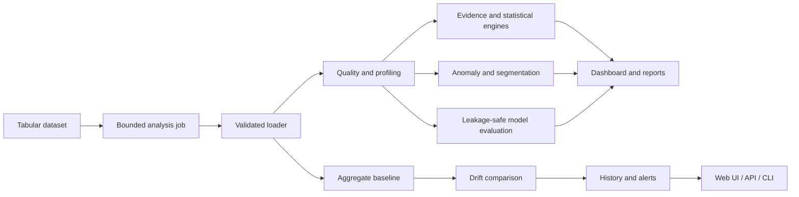

# Data Prism

[](https://github.com/NikitaMarshchonok/data-prism/actions/workflows/ci.yml)

**Evidence-first automated data science and drift monitoring for tabular data.**

Data Prism turns CSV, TSV, Excel, JSON, and Parquet files into an interactive analysis workspace. It combines deterministic data-quality checks, statistically validated findings, leakage-safe model evaluation, and persistent drift monitoring in one Flask application.

The project is designed as a decision-support system: every important conclusion should be traceable to a metric, sample size, confidence estimate, baseline, or diagnostic—not just an LLM-generated narrative.


## What the system does

| Area | Capabilities |
| --- | --- |
| Data intake | Validated uploads, safe filenames, normalized working copies, configurable size limits, and row limits |
| Profiling | Schema summary, missingness, duplicates, constant columns, distributions, correlations, and outlier diagnostics |
| Evidence engine | Ranked findings with supporting metrics, confidence levels, sample sizes, and recommended next steps |
| Statistical validation | Welch group comparisons, Pearson correlation, effect sizes, 95% confidence intervals, and Benjamini–Hochberg FDR correction |
| Exploratory ML | Multivariate anomaly scoring and quality-gated segmentation |
| Predictive ML | Leakage-safe preprocessing, holdout evaluation, cross-validated model selection, and naive-baseline comparison |
| Model reliability | Per-class metrics, calibration, residual analysis, permutation importance, split stability, and supported subgroup checks |
| Monitoring | Aggregate baseline profiles, PSI and categorical drift, missingness/schema changes, persistent history, and deduplicated alerts |
| Interfaces | BI dashboard, prompt-to-dashboard workspace, HTML/PDF reports, authenticated monitoring API, and cron/CI-ready CLI |
| Operations | Durable analysis-job states, bounded background execution, request IDs, structured JSON logs, managed temporary-artifact retention, and a CI-gated Render Blueprint |

## System overview



See [docs/ARCHITECTURE.md](docs/ARCHITECTURE.md) for component boundaries and [docs/DEPLOYMENT.md](docs/DEPLOYMENT.md) for the supported deployment and persistence model.

## Reproducible product demo

Start the application, open `http://localhost:5001/vibedash/`, and select **Run the live demo**. No upload or external model is required. The application generates the same privacy-safe SaaS dataset and dashboard specification on every run, then calculates:

- four traceable business KPIs and five visual diagnostics;
- evidence-backed data-quality, correlation, trend, outlier, and concentration findings;
- effect sizes, confidence intervals, p-values, and FDR-adjusted statistical results;
- multivariate anomaly candidates and exploratory segments with explicit guardrails.


The synthetic dataset can also be generated independently for scripts or notebooks:

```bash
python -m src.demo_data --output data/demo/saas_growth_demo.csv
```

The generator is deterministic by default, contains no personal information, and deliberately includes missing values and operational incidents so reviewers can verify that the analysis panels produce meaningful results.

In a JavaScript-enabled browser, VibeDash submits analysis through a durable job lifecycle and displays `queued` or `running` progress until the result is ready. Refreshing the page does not remove the SQLite job record. The original synchronous endpoint remains as a progressive fallback for clients without JavaScript.

## Quick start with Docker

```bash
git clone https://github.com/NikitaMarshchonok/data-prism.git
cd data-prism
cp .env.example .env
```

Replace both placeholder secrets in `.env`, then run:

```bash
docker build -t data-prism .
docker run --rm --env-file .env -p 5001:5001 data-prism
```

Open:

- Main analysis: `http://localhost:5001/`
- Prompt-to-dashboard: `http://localhost:5001/vibedash/`
- Liveness: `http://localhost:5001/healthz`
- Readiness: `http://localhost:5001/readyz`

The container runs Gunicorn as an unprivileged user. `/readyz` returns HTTP 503 if the persistent session key is missing or required runtime directories are not writable.

## Cloud deployment

The root `render.yaml` defines a free Docker web service with generated secrets, CI-gated deploys, structured logs, and `/readyz` health checks. After this repository is connected as a Render Blueprint, the built-in demo is available from the assigned public URL.

The free service filesystem is ephemeral. This is suitable for the portfolio demo, but drift history and uploaded artifacts require a paid persistent disk or future external storage. Follow [docs/DEPLOYMENT.md](docs/DEPLOYMENT.md) for exact setup, verification, persistence, and rollback guidance.

VibeDash working copies, session files, and generated HTML exports use a configurable retention window. `VIBEDASH_RETENTION_HOURS` defaults to 24 hours and accepts values from 1 to 720. Expired, application-owned artifacts are removed when VibeDash receives a request; unrelated files and symbolic links are never removed by this cleanup.

The public single-instance deployment runs one bounded in-process analysis worker. Active work is limited per signed browser session and across the service; interrupted jobs are reported as failed rather than remaining indefinitely in `running` state.

## Local development

Python 3.11 or 3.12 is recommended.

```bash
python -m venv .venv
source .venv/bin/activate
python -m pip install --upgrade pip
python -m pip install -r requirements.txt
cp .env.example .env
python web_app.py
```

`OPENAI_API_KEY` is optional. Without it, deterministic analytics and modelling remain available while the external AI summary reports that it is disabled.

## Monitoring API

The monitoring API is disabled until `DATA_PRISM_API_KEY` contains at least 32 characters.

Create an aggregate baseline without retaining raw rows:

```bash
curl -X POST http://localhost:5001/api/v1/drift/baselines \
  -H "X-API-Key: $DATA_PRISM_API_KEY" \
  -F "datafile=@reference.csv"
```

Run an idempotent drift check using the returned `baseline_id`:

```bash
curl -X POST http://localhost:5001/api/v1/drift/checks \
  -H "X-API-Key: $DATA_PRISM_API_KEY" \
  -H "Idempotency-Key: batch-2026-09-07" \
  -F "baseline_id=$BASELINE_ID" \
  -F "datafile=@current.csv"
```

Read monitoring state:

```bash
curl http://localhost:5001/api/v1/drift/runs \
  -H "X-API-Key: $DATA_PRISM_API_KEY"

curl http://localhost:5001/api/v1/drift/alerts \
  -H "X-API-Key: $DATA_PRISM_API_KEY"
```

Bearer authentication is also supported. Identical checks are deduplicated using an `Idempotency-Key` or the uploaded content hash.

## Automated drift jobs

Create a reusable aggregate baseline:

```bash
python monitor_drift.py create-baseline \
  --data data/reference.csv \
  --output data/baselines/reference.json
```

Copy `monitoring_job.example.json`, update its paths, and run:

```bash
python monitor_drift.py run \
  --config monitoring_job.json \
  --batch-id batch-2026-09-07
```

The command emits one JSON document. Exit codes are stable:

- `0`: check completed and the configured threshold was not reached;
- `1`: configuration, input, or execution error;
- `2`: the configured warning or critical threshold was reached.

## Tests and continuous integration

```bash
python -m unittest discover -s tests -p "test_*.py"
python test_vibedash.py
```

GitHub Actions runs the full suite on Python 3.11 and 3.12 for every pull request to `main`. The current suite covers data loading, security boundaries, evidence generation, statistical validation, model evaluation, reliability diagnostics, drift persistence, API behaviour, CLI jobs, and Flask integration.

## Repository structure

```text
data-prism/
├── web_app.py                 # Flask composition root and interactive workflow
├── monitor_drift.py           # Scheduled/CI drift command
├── src/
│   ├── data_loader.py         # Validated tabular ingestion
│   ├── demo_data.py           # Deterministic, privacy-safe product demo
│   ├── data_analyzer.py       # Profiling and data-quality checks
│   ├── dashboard_generator.py # Dashboard orchestration
│   ├── ml_predictor.py        # Leakage-safe model selection and evaluation
│   ├── model_reliability.py   # Stability and subgroup diagnostics
│   ├── data_drift.py          # Aggregate baseline and drift algorithms
│   ├── drift_store.py         # SQLite history and alert persistence
│   └── monitoring_api.py      # Authenticated monitoring endpoints
├── vibedash/                  # Prompt-to-dashboard and evidence engines
│   └── analysis_jobs.py       # Durable job states and bounded dispatcher
├── templates/                 # Flask/Jinja interfaces and reports
├── tests/                     # Unit and integration tests
├── .github/workflows/ci.yml   # Python 3.11/3.12 CI matrix
├── render.yaml                # CI-gated Render deployment Blueprint
└── Dockerfile                 # Non-root Gunicorn runtime
```

## Data and security boundaries

- Uploaded datasets, generated reports, local baselines, and SQLite history are runtime artifacts and are excluded from version control.
- VibeDash uploads, sessions, and exports are server-named and subject to the configured temporary-artifact retention window.
- Analysis-job status is isolated by a server-signed browser scope; job payloads and internal exceptions are not returned by the status API.
- Monitoring API keys are compared using constant-time comparison and are not used directly as storage identifiers.
- API drift uploads are transient; persisted baselines contain aggregate profiles rather than raw rows.
- Server-generated identifiers and filenames are validated before resolving filesystem paths.
- LLM output is supplementary. Core evidence, statistics, model metrics, and drift status are calculated locally.

## Current limitations

This is an actively developed portfolio system, not a managed enterprise platform.

- Classic analysis is synchronous; VibeDash uses a bounded in-process worker intended for the documented single-instance topology.
- Runtime state uses the local filesystem and SQLite rather than managed object storage and a distributed database.
- Temporary-artifact cleanup is request-triggered, so it is not a wall-clock deletion SLA; strict retention guarantees require a scheduler or storage-provider lifecycle policy.
- Predictive models are fast diagnostic baselines, not automatically deployable production models.
- Statistical findings are observational and must not be interpreted as causal conclusions.
- External alert delivery, managed scheduling, access-control roles, and production telemetry are not yet implemented.

## Roadmap

- Managed scheduling and external alert delivery
- External queue and independently scalable background workers
- Object-storage and PostgreSQL adapters
- Role-based access control and audit events
- Publish and verify the live portfolio deployment
