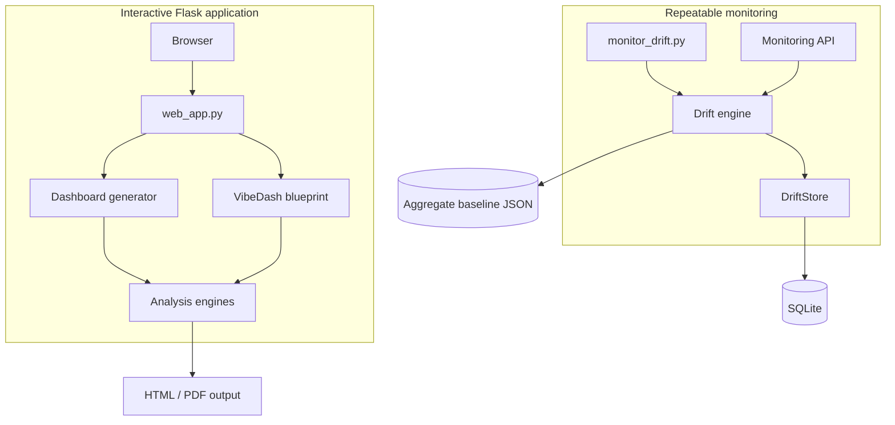
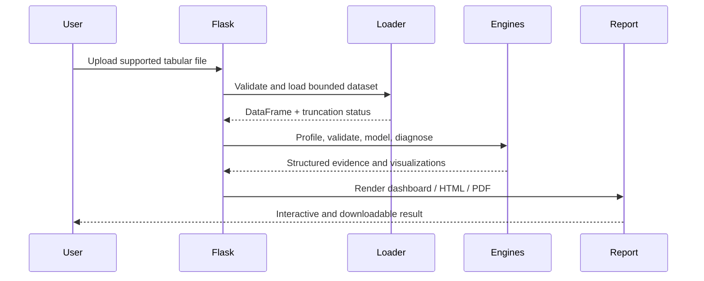
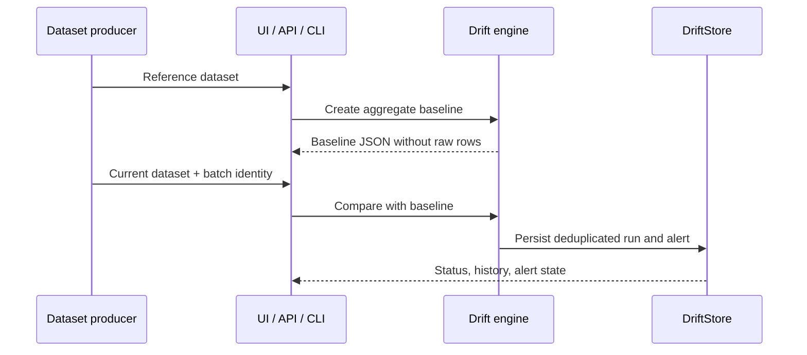

# Data Prism architecture

This document describes the current system boundaries and the reasoning behind them. It reflects the implementation in the repository rather than a hypothetical future platform.

## Design goals

Data Prism is built around four goals:

1. Produce useful tabular-data analysis with minimal configuration.
2. Keep important findings auditable through metrics, sample sizes, baselines, and diagnostics.
3. Prevent common evaluation mistakes such as target leakage and preprocessing on holdout rows.
4. Support both interactive exploration and repeatable drift-monitoring jobs.

It is not currently designed for distributed training, real-time streaming, multi-tenant authorization, or automatic model deployment.

## Runtime contexts

The same drift algorithms and persistence layer are shared by the browser, API, and CLI. This reduces the chance that interactive and automated checks produce different answers.

## Component map

| Component | Responsibility | Does not own |
| --- | --- | --- |
| `web_app.py` | Flask configuration, upload/session workflow, dashboard route, health endpoints | Statistical or ML algorithms |
| `src/data_loader.py` | Format validation, bounded loading, normalization | Business interpretation |
| `src/data_analyzer.py` | Descriptive profiling and data-quality checks | Predictive modelling |
| `vibedash/insight_engine.py` | Deterministic evidence-backed findings | Causal claims |
| `vibedash/statistical_engine.py` | Hypothesis tests, confidence intervals, effect sizes, FDR | Experiment design |
| `vibedash/anomaly_segmentation_engine.py` | Exploratory anomaly and segment analysis | Production clustering service |
| `src/ml_predictor.py` | Preprocessing, cross-validated model selection, holdout metrics, explainability | Model serving or retraining |
| `src/model_reliability.py` | Split stability and supported subgroup diagnostics | Fairness certification |
| `src/data_drift.py` | Aggregate profiles and baseline-to-current comparisons | Persistent storage |
| `src/drift_store.py` | SQLite run history, retention, deduplication, alerts | Drift calculation |
| `src/monitoring_api.py` | Authentication, validation, HTTP representation | Interactive user sessions |
| `monitor_drift.py` | Job configuration, stable JSON output, automation exit codes | Scheduling infrastructure |

## Interactive analysis flow

Uploaded source files receive server-generated identifiers. The main workflow stores a normalized CSV working copy for the session; these runtime files are excluded from version control.

## Model-evaluation boundary

The predictive block is an evaluation pipeline rather than an AutoML deployment service.

1. A target is selected explicitly or inferred from suitable columns.
2. Identifier-like, duplicated-target, constant, unsupported, and high-cardinality leakage risks are removed.
3. Data is split before preprocessing.
4. Imputation, scaling, and one-hot encoding are fitted only on training rows.
5. Candidate model families are compared with cross-validation inside the training partition.
6. The selected pipeline is evaluated once on the reserved holdout partition.
7. Results include naive-baseline comparison, model diagnostics, holdout permutation importance, and reliability notes.

This design supports honest exploratory evaluation. It does not establish that a model is ready for production deployment.

## Statistical-evidence boundary

The statistical engine separates discovery from presentation:

- group differences use Welch-style comparisons where appropriate;
- reported results include effect sizes and confidence intervals;
- multiple hypotheses use Benjamini–Hochberg false-discovery-rate correction;
- correlation results are explicitly observational;
- small or unsupported samples are withheld rather than presented with false confidence.

LLM summaries are optional and supplementary. They do not calculate the core metrics and are not required for deterministic analysis.

## Drift-monitoring flow

Monitoring compares numeric distributions with PSI and categorical distributions with frequency-based drift measures. It also detects missingness and schema changes. Batch identities or content hashes prevent duplicate events from producing duplicate runs.

## Persistence

| Data | Current storage | Lifecycle |
| --- | --- | --- |
| Interactive uploads | Local runtime directory | Session working data; ignored by Git |
| Reports and exports | Local runtime directory | Generated artifact; ignored by Git |
| Drift baselines | JSON aggregate profiles | Persistent until removed by operator |
| Drift history and alerts | SQLite | Retention-limited per monitoring scope |
| Secrets | Environment variables | Never committed to the repository |

The storage interfaces are local by design for this stage. Object storage and PostgreSQL adapters are natural extension points for a hosted multi-instance deployment.

## Security controls

- Supported file extensions and server-side filenames are validated.
- Upload and preview sizes are bounded.
- Monitoring endpoints remain disabled until a sufficiently long API key is configured.
- API keys are compared with constant-time comparison.
- Storage scopes are derived from hashes rather than raw secret values.
- Baseline identifiers, run identifiers, and filesystem paths are validated.
- VibeDash filter expressions use constrained parsing rather than unrestricted `eval`.
- Containers run as a non-root user.

These controls reduce common portfolio-app risks but do not replace a full production threat model, centralized identity provider, malware scanning, network isolation, or secret-management service.

## Deployment shape

The provided container runs Gunicorn and exposes liveness and readiness endpoints. The current supported topology is one application instance with writable persistent storage.

Scaling to multiple instances requires:

- shared object storage for uploads, exports, and baselines;
- PostgreSQL or another shared transactional store for monitoring history;
- background workers for long-running analysis;
- centralized sessions or stateless authentication;
- structured logs, metrics, traces, and external alert delivery.

## Verification

Pull requests execute compilation, dependency consistency checks, unit/integration tests, and VibeDash smoke tests on Python 3.11 and 3.12. Tests cover both successful workflows and defensive behaviour such as invalid uploads, unsafe expressions, missing credentials, idempotency, path validation, and insufficient statistical support.

