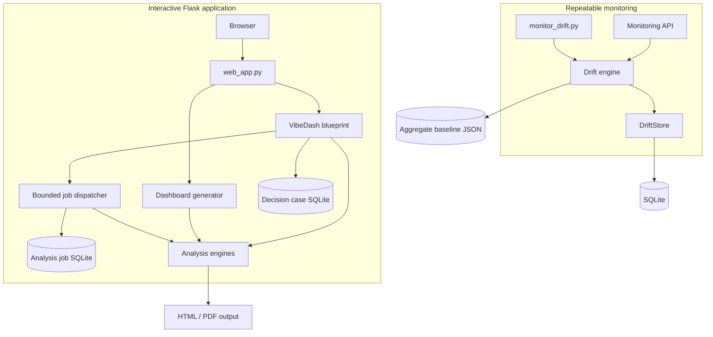
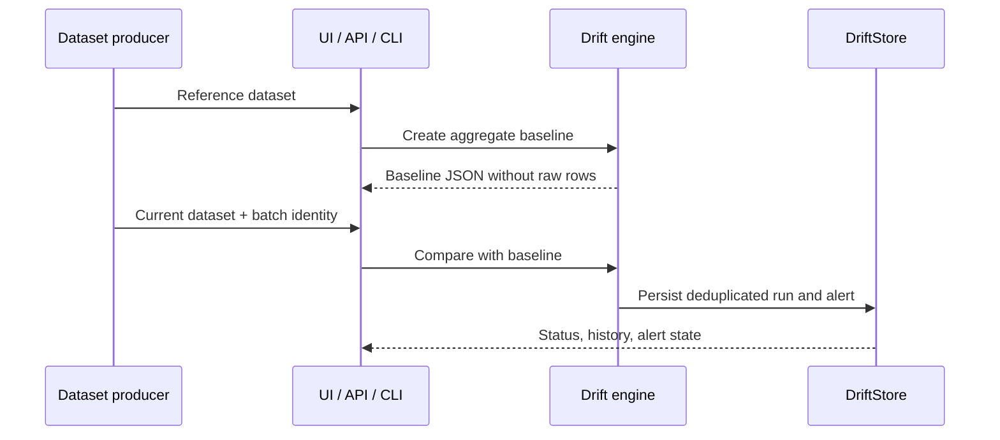

# Data Prism architecture

This document describes the current system boundaries and the reasoning behind them. It reflects the implementation in the repository rather than a hypothetical future platform.

## Design goals

Data Prism is built around four goals:

1. Produce useful tabular-data analysis with minimal configuration.
2. Keep important findings auditable through metrics, sample sizes, baselines, and diagnostics.
3. Prevent common evaluation mistakes such as target leakage and preprocessing on holdout rows.
4. Support both interactive exploration and repeatable drift-monitoring jobs.

It is not currently designed for distributed training, real-time streaming, multi-tenant authorization, or automatic model deployment.

## Runtime contexts



The same drift algorithms and persistence layer are shared by the browser, API, and CLI. This reduces the chance that interactive and automated checks produce different answers.

## Component map

| Component | Responsibility | Does not own |
| --- | --- | --- |
| `web_app.py` | Flask configuration, upload/session workflow, dashboard route, health endpoints | Statistical or ML algorithms |
| `src/observability.py` | Request correlation, structured application logs, deployment version, response safety headers | External log storage or tracing backend |
| `src/data_loader.py` | Format validation, bounded loading, normalization | Business interpretation |
| `src/demo_data.py` | Deterministic synthetic SaaS data for the product demo | User data or production fixtures |
| `src/data_analyzer.py` | Descriptive profiling and data-quality checks | Predictive modelling |
| `vibedash/insight_engine.py` | Deterministic evidence-backed findings | Causal claims |
| `vibedash/readiness_engine.py` | Pre-analysis quality, schema, privacy, and coverage contracts | Domain approval or source-data correction |
| `vibedash/decision_brief.py` | Deterministic ranking of evidence, decision risk, and next actions | Autonomous business decisions |
| `vibedash/decision_cases.py` | Session-scoped evidence snapshots, decision commitments, outcomes, and bounded retention | Identity, collaboration, or causal attribution |
| `vibedash/account_export.py` | In-memory, bounded serialization of account-owned job and decision-case metadata | Raw datasets, prompts, filenames, schema/session data, global pilot metrics, or durable export artifacts |
| `vibedash/pilot_metrics.py` | Opt-in lifecycle measurement, bounded retention, feedback, and read-only aggregate reports | Customer identity, source rows, or proof of demand |
| `src/runtime_backup.py` and `runtime_backup.py` | Offline bounded snapshots, integrity verification, and fail-closed restore into a new directory | Hosting persistence, encryption, authenticity, scheduling, or account recovery |
| `vibedash/statistical_engine.py` | Hypothesis tests, confidence intervals, effect sizes, FDR | Experiment design |
| `vibedash/anomaly_segmentation_engine.py` | Exploratory anomaly and segment analysis | Production clustering service |
| `vibedash/analysis_jobs.py` | Atomic job states, scoped lifecycle persistence, queue capacity, bounded background dispatch | Distributed task execution |
| `vibedash/audit_manifest.py` | Versioned dataset, schema, request, specification, and evidence fingerprints | Raw-row persistence or identity management |
| `src/quality_evaluation.py` | Known-signal and null-signal analytical regression scenarios | Domain certification or causal validation |
| `src/ml_predictor.py` | Preprocessing, cross-validated model selection, holdout metrics, explainability | Model serving or retraining |
| `src/model_reliability.py` | Split stability and supported subgroup diagnostics | Fairness certification |
| `src/data_drift.py` | Aggregate profiles and baseline-to-current comparisons | Persistent storage |
| `src/drift_store.py` | SQLite run history, retention, deduplication, alerts | Drift calculation |
| `src/monitoring_api.py` | Authentication, validation, HTTP representation | Interactive user sessions |
| `monitor_drift.py` | Job configuration, stable JSON output, automation exit codes | Scheduling infrastructure |

## Interactive analysis flow

```mermaid
sequenceDiagram
    participant User
    participant Flask
    participant Readiness
    participant Loader
    participant Engines
    participant Report

    User->>Flask: Upload supported tabular file
    Flask->>Readiness: In-memory dataset preflight
    alt Blocking issue detected
        Readiness-->>User: Evidence and remediation; no job created
    else Analysis allowed
        Readiness-->>Flask: Score, warnings, and contract
    end
    Flask->>Loader: Validate and load bounded dataset
    Loader-->>Flask: DataFrame + truncation status
    Flask->>Engines: Profile, validate, model, diagnose
    Engines-->>Flask: Structured evidence and visualizations
    Flask->>Report: Render dashboard / HTML / PDF
    Report-->>User: Interactive and downloadable result
```

Uploaded source files receive server-generated identifiers. The main workflow stores a normalized CSV working copy for the session; these runtime files are excluded from version control.

The VibeDash landing page also exposes a one-click demonstration path. For user uploads, a JavaScript client first calls the readiness endpoint, which reads the request stream and returns only aggregate checks. No Data Prism preflight working copy is retained. If analysis is allowed, the client creates a session-scoped job, polls its non-sensitive status representation, and opens the stored result after the job reaches `completed`. The bounded dispatcher atomically claims queued work so duplicate polls cannot execute one job twice. The original synchronous endpoint remains a progressive fallback and applies the same readiness gate.

The demo generates a fixed synthetic dataset and uses a versioned dashboard specification, bypassing optional prompt interpretation so it remains reproducible across machines. Both synchronous and background entry points call the same analysis-and-session pipeline.

On completion, that shared pipeline creates a deterministic decision brief with at most three priorities, each tied to calculated evidence, an explicit decision risk, and a verification action. It then stores a bounded audit manifest with the dashboard session. The background lifecycle also stores the manifest in the job record. The history route queries recent jobs by the signed guest-browser or pilot-account scope; status, result, history, and manifest endpoints never authorize by a job identifier alone. Version 2 manifests include the analysis contract and deployment version, SHA-256 fingerprints, schema metadata, coverage and truncation fields, readiness and brief summaries, and evidence counts. They do not include source row values.

A completed background result can create a decision case from one Decision Brief priority. The case stores an immutable, bounded evidence snapshot plus the user-defined owner, decision, success metric, target, and review date. Outcome updates move it between `tracking`, `validated`, `invalidated`, and `cancelled`; terminal states require an observed result. Both reads and writes require the same signed guest-browser or pilot-account scope, and form writes require a session-bound CSRF token. The case intentionally outlives the shorter analysis-artifact window, so the snapshot remains useful after the source result expires.

An owned active decision case can also download an in-memory RFC 5545 `.ics` all-day review reminder. Its UID is derived from the case identifier, its timestamp from the immutable case creation time, and its content from already bounded case fields. Calendar text is escaped and UTF-8 lines are folded before the response is returned with private, no-store and nosniff headers. There is no server-side calendar connection or reminder scheduler.

The decision workspace derives a review queue from the already scoped case list without adding another persistence layer. Tracking cases are classified as overdue, due today, due within seven days, or scheduled later and ordered by review date; non-tracking cases are classified as closed and ordered by their last update. Counts and filters are calculated only after the store has applied the current guest-browser or pilot-account scope.

`GET /vibedash/decisions/<case_id>/report.html` produces an owned, in-memory standalone decision report. A strict view builder copies only approved bounded fields from the stored case and evidence snapshot; source rows and unrecognized snapshot fields are excluded. The document contains inline trusted CSS but no scripts, forms, external assets, or private route links, and the response applies private/no-store, nosniff, frame denial, no-referrer, and restrictive CSP headers. The exported copy is not persisted by Data Prism and is outside subsequent retention or deletion controls.

### Account export boundary

An authenticated pilot account can submit `POST /vibedash/account/export.json`
from the account settings page with the account-authentication CSRF token. The
route resolves the account first, derives its deterministic account scope, and
reads only that scope from the job and decision-case stores. It requests one
bounded page from each store: the newest 50 jobs and newest 100 decision cases;
the serialized document carries explicit truncation flags when older records
exist. No account, scope, job, or case identifier is accepted from the HTTP
request.

The export is an in-memory JSON download named from the first 12 characters of
the account id. It intentionally excludes raw datasets, prompts, filenames,
schema/session data, and global pilot metrics. Builder or serialization failures
return a generic response and never log account-owned content. The route does
not create a file or extend artifact retention.

### Account deletion boundary

The account settings page also submits `POST /vibedash/account/delete` with the
account-authentication CSRF token, current password, and an exact `DELETE`
confirmation. The route resolves the authenticated account and its deterministic
analysis scope; it does not accept an account id or scope id from the request.
Deletion is refused while that scope has queued or running jobs, so the user
must retry after active work completes. Once idle, the local implementation
fences the scope and purges the account record, account-owned jobs and decision
cases, opt-in pilot measurements, and server artifacts whose ownership can be
identified safely from persisted scope metadata.

The account SQLite store, analysis-job SQLite store, and filesystem artifact
cleanup are separate boundaries and therefore do not provide a cross-store
atomic deletion guarantee. A cleanup failure is retryable; an artifact whose
ownership cannot be established is deliberately left for normal retention
cleanup rather than guessed. Classic analysis and monitoring state is not
account-owned by this flow. Local copies/downloads and historical offline
backups are outside the server's control and are not erased. Free-host
ephemerality may remove any of this state earlier after a restart or redeploy.

### Two-period comparison boundary

The VibeDash landing page's **Compare two periods** form accepts two CSV snapshots: a baseline and a current period. The route queues a guest-browser or pilot-account-scoped asynchronous job, and the worker loads both frames, runs readiness checks, and builds an aggregate-only `period-comparison-v1` result. The result combines schema changes and distribution drift with numeric current-minus-baseline mean deltas. Shared numeric metrics that have sufficient finite observations are tested with Welch's independent-samples t-test; each tested metric includes a 95% confidence interval and Hedges' g, and raw p-values are adjusted with Benjamini–Hochberg FDR. The comparison is observational and non-causal: it does not attribute a difference to an intervention, and seasonality, population-mix changes, confounding, or row dependence can account for observed changes.

The comparison resource contract is bounded in both request and process memory: each file is limited to 100,000 rows and 100 columns; the pair is limited to 100,000 combined rows and 100 combined columns, 100 MiB of uploaded bytes, and 256 MiB of combined in-memory frames. Inferential work is capped at 32 candidate metrics, with up to 8 displayed and a minimum of 8 finite observations in each period for a test. These limits apply to the comparison as a whole where stated, so two individually valid files cannot exceed the combined budget.

`POST /vibedash/comparisons/jobs` creates the job. The browser polls `/vibedash/jobs/<job_id>`, then follows `/result`; `/manifest` exposes the aggregate-only reproducibility manifest, `/comparison-report.html` downloads a completed comparison as a server-named standalone HTML document, and `/history` lists recent jobs for the same signed guest-browser or pilot-account scope. The report endpoint loads only the job's scoped retained session, renders in memory with trusted CSS inlined, and does not persist an export artifact or extend retention. The two source CSVs are removed after worker processing (including failure cleanup). The aggregate result, session record, manifest, and report availability follow `VIBEDASH_RETENTION_HOURS` (24 hours by default); browser Print/Save as PDF is supported by print CSS, without server-side PDF generation. This flow does not provide durable storage or paid/production guarantees.

## Model-evaluation boundary

The predictive block is an evaluation pipeline rather than an AutoML deployment service.

1. A target is selected explicitly or inferred from suitable columns.
2. Identifier-like, duplicated-target, constant, unsupported, and high-cardinality leakage risks are removed.
3. Data is split before preprocessing.
4. Imputation, scaling, and one-hot encoding are fitted only on training rows.
5. Candidate model families are compared with cross-validation inside the training partition.
6. The selected pipeline is evaluated once on the reserved holdout partition.
7. Results include naive-baseline comparison, model diagnostics, holdout permutation importance, and reliability notes.

This design supports honest exploratory evaluation. It does not establish that a model is ready for production deployment.

## Statistical-evidence boundary

The statistical engine separates discovery from presentation:

- group differences use Welch-style comparisons where appropriate;
- reported results include effect sizes and confidence intervals;
- multiple hypotheses use Benjamini–Hochberg false-discovery-rate correction;
- correlation results are explicitly observational;
- small or unsupported samples are withheld rather than presented with false confidence.

LLM summaries are optional and supplementary. They do not calculate the core metrics and are not required for deterministic analysis.

## Drift-monitoring flow



Monitoring compares numeric distributions with PSI and categorical distributions with frequency-based drift measures. It also detects missingness and schema changes. Batch identities or content hashes prevent duplicate events from producing duplicate runs.

## Persistence

| Data | Current storage | Lifecycle |
| --- | --- | --- |
| Interactive uploads | Local runtime directory | Session working data; ignored by Git |
| Reports and exports | Local runtime directory for legacy exports | Legacy generated artifacts are retention-limited; comparison HTML downloads are streamed and not persisted |
| Analysis job lifecycle and audit manifest | SQLite | Session-scoped terminal records follow VibeDash retention |
| Opt-in pilot measurement | Analysis-job SQLite | 30 days from acceptance; 10,000-row cap; guest-browser or pilot-account-scope withdrawal |
| Decision cases and measured outcomes | SQLite | Guest-browser or pilot-account scoped; closed cases follow decision retention, active cases remain |
| Drift baselines | JSON aggregate profiles | Persistent until removed by operator |
| Drift history and alerts | SQLite | Retention-limited per monitoring scope |
| Pilot accounts and login throttling | Dedicated SQLite | Optional account records; retained until the runtime store is removed |
| Secrets | Environment variables | Never committed to the repository |

### Optional VibeDash pilot accounts

VibeDash supports a deliberately small first-party pilot account boundary. A
dedicated SQLite store lives below the configured `DATA_PRISM_STATE_DIR` and is
opened lazily, cached in the Flask application extensions, and never closed by
a per-request teardown. Registration and login use session-bound CSRF tokens,
bounded password hashing/throttling, and generic failure responses. A valid
logged-in account derives a deterministic 32-hex scope from its account id and
the Flask secret key; guests continue to receive random browser scopes. The
signed-cookie VibeDash identity contains the account id and an opaque
credential token derived from the current password hash. Every authenticated
request validates that pair atomically with `account_for_credential`; cookies
without a valid token fail closed. Logout and authentication transitions rotate
VibeDash identity, scope, and CSRF keys while preserving unrelated classic
upload/report and monitoring state. Password change rotates those keys, keeps
the changing browser signed in with a fresh token, and invalidates copied old
cookies because their token was derived from the previous hash. Ordinary
client-side cookie rotation cannot revoke a separately copied cookie, so
deployments requiring immediate revocation before a password change need a
server-side session/revocation store. The Flask secret is also part of the
deterministic account-scope derivation, so a secret-key rotation requires users
to sign in again and makes prior account-owned job history unavailable under
the new scope.

Account settings remain intentionally narrow: password changes, bounded export,
and scoped deletion. There is no email verification, recovery channel, or team
access in this pilot. Free-host storage is ephemeral and account records, jobs,
uploads, and history may disappear when the host restarts.

This is an optional free-host pilot boundary, not enterprise identity,
recovery, team access, or a durability guarantee. Guest analyses are not
claimed or migrated after registration. Account records, jobs, uploads, and
history may disappear when an ephemeral host restarts.

The storage interfaces are local by design for this stage. Object storage and PostgreSQL adapters are natural extension points for a hosted multi-instance deployment.

Offline runtime backup is operator-controlled local tooling, not a persistence
service. It requires all writers to be stopped, keeps signing/API secrets
outside the snapshot, and provides no managed, off-host, encrypted, or scheduled
backup. A real durable-state and recovery gate therefore remains separate from
the presence of this CLI.

## Security controls

- Supported file extensions and server-side filenames are validated.
- Upload and preview sizes are bounded.
- Active analysis jobs are bounded per signed guest-browser or pilot-account scope and per service instance.
- Decision writes require a session-bound CSRF token and cases are bounded per guest-browser or pilot-account scope.
- Monitoring endpoints remain disabled until a sufficiently long API key is configured.
- API keys are compared with constant-time comparison.
- Storage scopes are derived from hashes rather than raw secret values.
- Baseline identifiers, run identifiers, and filesystem paths are validated.
- VibeDash filter expressions use constrained parsing rather than unrestricted `eval`.
- Containers run as a non-root user.

These controls reduce common portfolio-app risks but do not replace a full production threat model, centralized identity provider, malware scanning, network isolation, or secret-management service.

## Deployment shape

The provided container runs Gunicorn and exposes liveness and readiness endpoints. Runtime state can be redirected with `DATA_PRISM_STATE_DIR`. The current supported topology is one application instance with writable local storage and one bounded in-process VibeDash analysis worker.

Job records survive page refreshes, while a process interruption converts stale `running` work to a safe failed state. This avoids pretending that an in-process executor provides distributed delivery guarantees. Multiple web processes or instances require an external transactional queue and independently managed workers.

Every response receives a bounded `X-Request-ID`. Production JSON access events record the normalized Flask route, status, latency, and deployment version without including raw URLs, query strings, request bodies, client addresses, or session identifiers. Render supplies the deployment commit through `RENDER_GIT_COMMIT`; the health endpoints expose its shortened value for verification.

Scaling to multiple instances requires:

- shared object storage for uploads, exports, and baselines;
- PostgreSQL or another shared transactional store for monitoring history;
- an external queue and independently scalable workers for long-running analysis;
- centralized sessions or stateless authentication;
- structured logs, metrics, traces, and external alert delivery.

## Analytical quality boundary

The repository distinguishes function correctness from analytical behaviour.
Unit tests exercise algorithms and defensive paths, while
`evaluate_quality.py` assembles the evidence, statistical, anomaly, and
segmentation engines against seeded synthetic scenarios with known properties.

The versioned threshold configuration checks signal recovery, false-discovery
guardrails, incident ranking, segment quality, and deterministic repetition.
Results include observed and expected values for every check and are retained
as CI artifacts. Thresholds are behavioural tolerances rather than exact
floating-point snapshots, so supported runtime versions can differ in
irrelevant numerical details without hiding material regressions.

Passing this gate demonstrates that the implemented analytical contracts still
hold. It does not establish causal validity, production model readiness, or
fitness for an unreviewed business domain.

## Verification

Pull requests execute compilation, dependency consistency checks, unit/integration tests, the analytical quality gate, and VibeDash smoke tests on Python 3.11 and 3.12. After those jobs pass, CI builds and starts the production container, verifies readiness and request correlation, and checks for structured runtime logs. Tests cover both successful workflows and defensive behaviour such as invalid uploads, unsafe expressions, missing credentials, idempotency, path validation, and insufficient statistical support.
